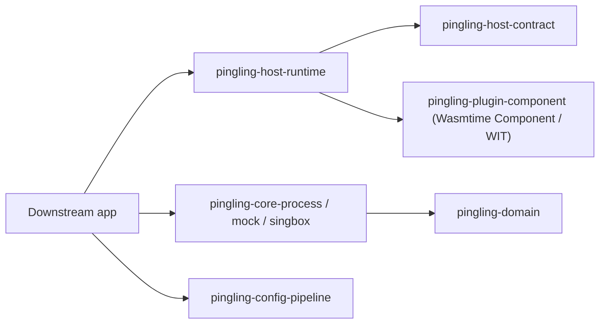

# Pingling

Pingling is a public foundation for small extension-driven VPN/proxy hosts.

This repository intentionally contains only:

- stable slot names and payload envelopes;
- manifest and registry types for composing multiple extensions;
- WIT/component runtime defaults;
- deterministic ordering and conflict rules for slot ownership;
- host/runtime traits used by extension runners;
- configurable path, storage, process-core, config-pipeline, netwatch, and
  component adapter building blocks;
- primitive no-op implementations for local tests and examples.

Product-specific auth, billing, fleet policy, platform packaging, and service
integration belong in downstream repositories. Public code must not encode those
decisions.

## Crates

- `pingling-host-contract`: shared types and traits for slot-based extension
  calls, plugin manifests, and host-side registry planning.
- `pingling-host-runtime`: loaded-plugin registry and policy execution.
- `pingling-plugin-component`: Wasmtime Component runtime defaults and
  WIT package preparation helpers.
- `pingling-domain`: core lifecycle, profile, storage, pipeline, and plugin
  traits.
- `pingling-core-process`: configurable process-backed `VpnCore`.
- `pingling-core-mock`: in-process reference core for tests and demos.
- `pingling-core-singbox`: sing-box CLI preset over the process core.
- `pingling-config-pipeline`: generic ordered config processors.
- `pingling-paths` and `pingling-storage`: configurable layout and simple
  storage helpers.
- `pingling-netwatch`: cross-platform network-interface watch contract.
- `pingling-primitive-host`: tiny CLI host for local smoke tests.



## Extension Shape

Extensions can declare the methods and slot phases they implement with a
`PluginManifest`. Hosts can index those manifests through `PluginRegistry` and
choose concrete execution behavior without learning product-specific details.

The public contract names the common daemon slots:

- `config.process`
- `deeplink.resolve`
- `auth.session`
- `vpn.connect`
- `vpn.disconnect`
- `plugin.load`

Slots run in phase order: `before`, `exec`, `after`. Multiple extensions can
bind the same slot when the slot policy permits it. Registry ordering is
deterministic: lower priority first, then plugin id as a stable tiebreaker.

Policies are explicit:

- `pipeline`: sequential transforms where each output becomes the next input.
- `first_success`: ordered handlers where the first concrete result wins.
- `single_owner`: exactly one extension may own that slot phase.
- `broadcast`: every extension observes; output is ignored by the host.
- `best_effort`: every extension runs and host policy may suppress failures.

## Boundary

The public boundary is the protocol. A downstream application owns how slots are
implemented and which component packages are loaded. The active plugin runtime
is WASI/component based; historical adapter implementations are intentionally
not part of this repository.

## Local Checks

```bash
cargo test --workspace --all-targets --locked
cargo run -p pingling-primitive-host -- status
```
